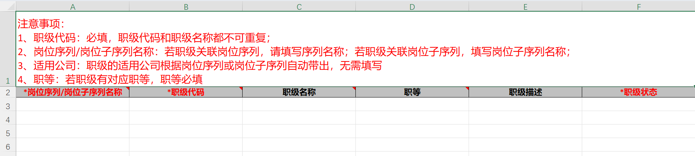

# 薪福通组织管理配置
## 1.　组织管理
###　1.1　组织-组织架构
批量导入模板：

生效日期：组织创建之后在系统上生效的时间
组织编码：数据类型：字符串；不能出现相同的两个值
组织全路径：格式：**<一级组织>/<二级组织>/<三级组织>/…/<n级组织>**
机构号：目前没有作用，可不填。组织编码体现组织的序号
组织负责人：一把手
审批主管：经理级，单个组织最多可设置20名
单个组织新增的时候必须填写其上级组织；通过模板批量导入组织的时候可以通过组织全路径自动读取上下级组织

####　1.1.1　组织-组织架构-组织基础设置
这里可以设置组织架构中每个组织的基本信息

从生效日期到备注都是默认设置且必须启用的，其中生效日期、组织名称、组织类型、上级组织是必填项
字段编码：每一字段相对应的编码，用于客制化开发时的`properties`。默认字段的字段编码无法修改，新增字段的字段编码可以自定义（选填）。如果在新增字段时不自定义编码，则系统会自动生成格式为`org_ext_00000000000x`的自增字段编码。字段新增完成后，字段编码无法再修改。该字段删除后，自动生成的编码也不会重新从之前的值开始算。例：之前已经新增了10个字段，默认编码为`…0001-…0010`。此时删除这10个字段并再新增一个字段，则新增字段的编码为`…0011`。
字段类型：有四项可选，分别为单行文本，单选，多选，选择成员，其中：单选、多选必须先添加选项；选择成员最多可选择20名（同审批主管项）。
字段来源: 有两种,分别为系统字段和自定义字段。
是否必填: 可选必填或选填。
启用状态: 除系统字段, 其他字段(包括系统字段的组织职能)可选择不启用。
表头展示设置：如果勾选这一项，则可以在组织架构总览表格中看到勾选项目的信息。默认展示组织名称、直属成员、成员总数。
	成员总数：默认指该组织的所有直属成员、下级组织的所有成员，包括兼任、借调/外派成员。兼任、借调/外派成员可在成员设置中调整。

##### 1.1.1.1 组织-组织架构-组织基础设置-组织类型
组织类型:

组织类型包括默认的**集团、部门、分公司、子公司、事业部、门店、项目组**，支持新增组织类型。新增组织类型必填名称，选填说明。名称和说明可后续修改。组织类型的编码无法修改，其中系统组织类型的编码为首字母，自定义组织类型的编码为`010x`的自增数字。自增数字的规则同字段编码。

### 1.2 组织-架构图
架构图可展示该企业的所有部门级部门关联关系。

组织架构图可选择是否显示直属成员，可选择显示范围（指定某一部门并展示其与其下属部门），可设置组织字段显示（可选组织编码，组织类型，负责人，成员总数，下级组织数），可设置视图（自适应，横向，纵向），可修改排序，可展开/折叠指定层级，可导出架构图为`.png`文件。

### 1.3 编制管理
编制管理指设置某部门/某部门及部门某岗位最多可有多少名员工的管理。当前支持组织、组织+岗位两种管理模式。如果是组织+岗位的管理模式，建议设置员工信息-岗位为必填且开启，否则可能会出现部门编制有余量但岗位编制已满时，员工仍能加入部门的情况。

可选择管理力度为强控制/弱控制。强管理指超过编制数量时，员工不能入职；弱管理指超过编制数量时，在经过警示后，员工仍能入职。
可选择细分。具体体现在人事管理的各个节点（花名册新增/修改，人事异动的添加待入职/已入职，确认/重新入职，取消离职，OA审批的录用/调动审批时）的控制力度。可选择为当前力度或不校验。
可设置编制占用计算方式。默认为**占编人数=在职人数+录用审批中+待入职人数+待调入人数-待离职人数-待调出人数**。可设置录用审批中、待入职、待离职是否占用编制。可设置兼任是否占用编制。

#### 1.3.1 编制管理-编制计划
创建编制计划时需输入计划名称和计划周期。该编制管理将于计划周期生效。
创建完后，可修改编制计划，设置编制控制节点。默认从叶子部门开始。如果是部门管理模式，则可以从中间部门开始。该模式下，仅需设置一中间部门的总编制数，其与其下属所有部门共用总编指数。
如果是部门+岗位管理模式，则必须从叶子节点开始。每一级编制先设置该部门编制数，再进入部门中设置每一岗位编制数。**注意，此操作需现在岗位管理中关联部门-岗位。**部门中所有岗位的编制数之和不能大于该部门编制数。

### 1.4 岗位管理

可单次或批量新增岗位。新增岗位时必填岗位名称，选填岗位编码。岗位编码默认生成`<岗位序列编码>+<000x>的自增数字`。
适用公司：选填。当有多家公司时，可选择多家公司。如果是批量导入，则可新增数列`适用公司`并且填入对应公司名称。
岗位序列/子序列: 岗位通道。默认有专业通道和管理通道。可自定义。批量导入时，可输入序列/子序列名称或岗位编码。两者都输入时以编码为准。
所属组织：即岗位关联部门。可关联多个部门，需新增数列`所属组织`并填入。
顺序号：对不同岗位排序的编号。

#### 1.4.1 岗位序列/岗位子序列

可单次或批量新增岗位序列。默认有专业通道和管理通道。

岗位序列编码：选填，可自动生成。自动生成格式为`C00000000x`的自增数字。自增规则同字段编码。
岗位序列名称：必填，不可重复。
适用公司：选填，可选择公司。如果为空，则所有人可见。如果适用于公司及其所有子公司，填写`<公司名称>(含其下级公司)`；如果适用于多个不同的父节点公司，可新增数列`适用公司`并且填入对应公司名称。
顺序号：选填，对不同岗位排序的编号。
岗位序列状态：必填，可选择已启用/已停用。

可单次或批量新增岗位子序列。岗位子序列指岗位序列中的子项，如专业序列-财富，专业序列-时长，专业序列-对公等。
岗位子序列编码：选填，可自动生成，规则同岗位序列编码且共用一套格式。
岗位子序列名称：必填，不可重复。
岗位序列编码/名称：子序列所属的岗位序列。必填。都填写时以编码为准。
适用公司：选填，可选择公司。如果为空，则所有人可见。如果适用于公司及其所有子公司，填写`<公司名称>(含其下级公司)`；如果适用于多个不同的父节点公司，可新增数列`适用公司`并且填入对应公司名称。
岗位子序列状态：必填，可选择已启用/已停用。

### 1.5 职级管理

可单次或批量新增职级。新增职级时必选岗位序列/子序列。
适用公司：无需填写，根据岗位序列/子序列适用公司自动带出。
职级代码：必填，如`P1`（专业一级），`M3`(管理三级)。
职级名称：选填。
职等：选填，指职级的内部等级，支持自定义。例，如果设置了一级，二级，三级，四级，五级，则可以在初级专业职级中选择一到五级，这样就会有初一级，初二级……初五级一级五等。

    职等支持单次或批量设置。批量设置职等的格式为`<职等代码>, <只等名称>`，支持从excel粘贴导入，单次批量新增不能超过999个。
职级描述：选填。
职级状态：必填，可选择已启用/已停用。

### 1.6 职位管理
职位不同于职级。职级指员工的等级，如行员等级；职位指员工所处的位置，如普通员工，经理，负责人，总监等。

可单次或批量新增职位。新增职位时选填职位编码，必填职位名称。
职位编码：选填，可自动生成。自动生成格式为`J000x`的自增数字。如果删除某一职位后再新增，则数字会重新计算。
职位名称：必填。
顺序号：默认为9999.

### 1.7 组织管理设置
可设置部门展示形式。
可勾选按组织类型、组织层级展示，勾选之后，将在员工花名册列表、员工信息详情等页面看到勾选的项目。
可设置其他，如职等，编制管理等。